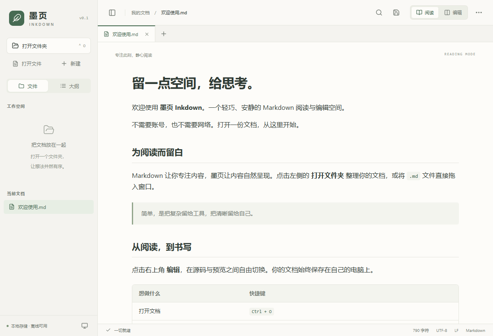

# 墨页 Inkdown

面向 Windows 10/11 x64 的轻量、离线 Markdown 阅读与编辑器。Tauri 2 + Svelte 5 + TypeScript，复用系统 WebView2，不打包 Chromium。

[产品网站与下载](http://150.158.39.166/inkdown/) · [GitHub Releases（HTTPS 备用下载）](https://github.com/machaoxin0407/inkdown/releases/latest) · [反馈问题](https://github.com/machaoxin0407/inkdown/issues)



免费开源，采用 [MIT 许可](LICENSE)。第三方组件仍适用各自许可，详见 [第三方许可声明](THIRD_PARTY_NOTICES.txt)。当前发行版未签名，不包含自动更新。

## 使用

- 运行发布目录中的 `Inkdown.exe`，或使用 NSIS 安装器安装到当前用户。
- 打开 `.md`、`.markdown`、`.mdown` 文件，或拖入文件/文件夹。安装版注册文件类型；是否设为默认程序由 Windows 默认应用设置决定。
- 默认阅读；切换「编辑」进入 CodeMirror 源码和实时预览分栏。拖动中间分隔线调整比例，也可以聚焦分隔线后按左右方向键。
- 编辑区上下滚动时，预览按源码位置同步滚动；可单独滚动预览，下一次滚动编辑区时恢复联动。公式、图表加载及分栏宽度变化后会重新计算对应位置。
- 使用顶部 − / + 调整文档缩放（50%–200%），点击百分比恢复 100%。支持 Ctrl+滚轮，自动记住比例；编辑文字与预览一起缩放，PDF 保持固定排版。
- 点击右上角「更多操作 → 导出为 PDF」，或按 Ctrl+Shift+P，选择保存位置。导出当前文档（包含未保存的编辑），使用 A4 白底排版，保留公式、图表、本地图片与可选择文字；不修改 Markdown 原文件。
- 编辑停止 2 秒后自动备份草稿，持续输入时最长每 10 秒备份一次；启动时可选择恢复、丢弃或稍后处理，也可从「更多操作 → 恢复草稿」再次查看。草稿保存在本机应用数据目录，不覆盖原文件；保存成功或明确放弃后清除。
- 记住最近 200 份文件的阅读位置、编辑光标和阅读/编辑模式；重启或重新打开后恢复。缩放和窗口变化后按源码位置定位。
- 按 Ctrl+P 或顶部文件夹图标快速打开：搜索已打开标签、最近文件和工作区 Markdown 文件名/路径，支持模糊匹配、方向键与 Enter；新增文件后可点击「刷新索引」。
- 普通代码块右上角可一键复制，保留缩进和换行；PDF 不包含复制按钮。
- 文件/大纲侧栏可折叠，文件树按需展开，多标签保留编辑历史和滚动位置。
- 支持表格、任务列表、代码高亮、KaTeX 数学公式、Mermaid 图表和本地图片。所有渲染资源都在应用内，运行不依赖 CDN。
- 点击左下角主题按钮，依次切换跟随系统、浅色、深色。最近文件和已保存文档的标签会话自动恢复。

| 快捷键 | 功能 |
| --- | --- |
| Ctrl+O / Ctrl+Shift+O | 打开文档 / 打开文件夹 |
| Ctrl+P | 快速打开文件 |
| Ctrl+N | 新建文档 |
| Ctrl+S / Ctrl+Shift+S | 保存 / 另存为 |
| Ctrl++ / Ctrl+- | 放大 / 缩小文档 |
| Ctrl+0 | 恢复 100% 缩放 |
| Ctrl+滚轮 | 放大 / 缩小文档（正文或编辑区） |
| Ctrl+E | 切换阅读/编辑 |
| Ctrl+Shift+P | 导出为 PDF |
| Ctrl+F | 阅读查找 / 编辑器搜索替换 |
| Ctrl+W | 关闭当前标签 |
| Ctrl+B | 展开/折叠侧栏 |
| Ctrl+Z / Ctrl+Y | 编辑撤销/重做 |

## 文件与离线行为

- 第一版支持 UTF-8，保留 BOM 及 LF/CRLF；混合换行统一为文件中占多数的格式。非 UTF-8 文件会明确报错，绝不按错误编码覆盖。
- 文件保存前后比较 SHA-256 指纹，写入同目录临时文件并同步，再原子替换目标。外部修改会要求重新加载、另存为或明确覆盖；只读和失败操作保留编辑内容。
- 关闭标签、退出和切换工作区会询问未保存修改。意外退出后可恢复最近一次成功备份的草稿；最后一个备份间隔内的输入可能尚未落盘。恢复不自动覆盖源文件，磁盘已变化时仍需处理保存冲突。
- 单文档上限 32 MB，单图片上限 16 MB。工作区隐藏点号目录、`node_modules`、`target`、`dist` 和符号链接；每级树先显示 150 项，可继续加载。
- 本地图片仅允许相对路径，规范化后必须位于文档目录，或文档所属的已打开工作区内。不加载网络图片；HTTP(S)/邮件链接只有用户点击才会交给系统打开。
- 原始 HTML 作为文本显示，渲染 HTML/SVG 经 DOMPurify 清理；KaTeX 禁用受信任命令，Mermaid 严格模式；CSP 禁止远程资源、iframe、对象和表单提交。
- 首次安装到没有 WebView2 的机器时需要联网安装微软运行时；已有 WebView2 的机器上可离线运行。WebView2 运行时的安装体积和浏览器缓存不算应用本体体积。

## 开发与构建

需要 Node.js 22.12+、Rust stable MSVC 工具链、Visual Studio 2022 Build Tools 的 C++ 工作负载及 Windows SDK。

```powershell
npm ci
npm run desktop          # 启动 Tauri 开发窗口
npm run package          # 检查类型、打包资源、构建 Windows NSIS 安装器
```

当前工作区的 Rust 工具链安装在 `.tools/cargo`、`.tools/rustup`；脚本会自动识别。C++ 工具安装在 `.tools/vs`，通过 Visual Studio 注册表发现。其他电脑可使用常规全局工具链。

```powershell
npm run dev              # 仅浏览器界面预览，本地文件操作需桌面版
npm run check
npm test
powershell -NoProfile -ExecutionPolicy Bypass -File scripts/desktop.ps1 test
node scripts/check-ui.mjs       # 需先启动 npm run dev，需本机 Chrome
node scripts/check-productivity.mjs # 草稿、位置、快速打开与原生剪贴板
node scripts/check-zoom.mjs --native # 桌面缩放、持久化与同步滚动
node scripts/check-native.mjs   # 需先构建 release；不要同时运行其他墨页实例
node scripts/check-reading-fixes.mjs          # 浏览器：图表文字与同步滚动
node scripts/check-reading-fixes.mjs --native # 桌面：图表文字与同步滚动
```

浏览器测试覆盖阅读、编辑、查找、撤销、多标签、主题和布局；桌面测试通过真实 WebView2 和 Rust 后端执行文件操作，文件选择框的返回路径由测试注入，不操作系统对话框。测试文件、截图、报告在 `artifacts/`，使用独立 WebView 配置目录和应用数据目录，不影响正常使用设置。草稿与位置默认存于 `%LOCALAPPDATA%/com.inkdown.reader/`；测试通过进程环境变量 `INKDOWN_DATA_DIR` 隔离这些数据，前端不能指定存储路径。

构建输出：`src-tauri/target/release/inkdown.exe`；安装器：`src-tauri/target/release/bundle/nsis/`。首次构建需要从 crates.io、npm 和 Tauri GitHub release 下载构建依赖。发行文件未进行代码签名。

`release/` 提供已构建的安装器、免安装程序、打包 ZIP、示例、许可和 SHA-256 校验文件。详细实测和验证边界见 `VALIDATION.md`。开发工具、`node_modules` 和 `target` 不属于发布包。

构建后执行 `powershell -NoProfile -ExecutionPolicy Bypass -File scripts/collect-release.ps1` 整理交付目录。依赖更新后执行 `python scripts/generate-notices.py` 更新第三方许可文本，然后重新打包。

## 代码结构

- `src/App.svelte`：标签、工作区、快捷键、保存与冲突决策。
- `src/lib/`：类型、Tauri 桥接、Worker 解析、离线增强渲染、编辑状态缓存。
- `src-tauri/src/lib.rs`：文件读取、指纹检查、安全保存、目录和图片访问、单实例文件转发。
- `examples/`：正常渲染、错误隔离、安全输入和本地图片示例。

当前版本不包含云同步、插件、自动更新，以及文件树中的删除/移动功能。PDF 导出固定为 A4 纵向；暂不提供纸张和页边距设置。

## 贡献与网站部署

欢迎通过 Issues 报告问题（附版本、重现步骤及不含隐私的示例），或提交 Pull Request。修改应用后运行 `npm test` 与 `npm run check`；文件操作的修改还需运行 Rust 单测及桌面验证。不要提交凭据、个人文件、依赖目录或构建产物。

网站为 `website/` 中的静态文件。自动部署、软件发行和回滚步骤见 [DEPLOYMENT.md](DEPLOYMENT.md)。网站自动部署与桌面软件自动更新是不同功能：桌面软件仍需手动下载安装新版。
